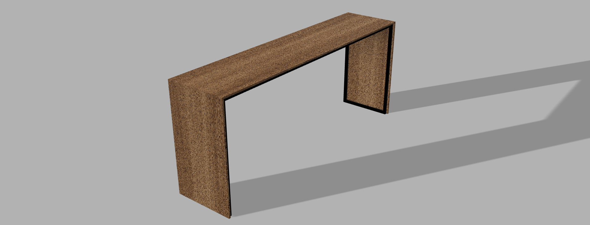

# Bedside Table | Table de Lit

A minimalist bedside table design with a modern C-shaped profile, combining industrial steel structure with natural wood finishing.

## 📐 Technical Specifications

| Dimension | Measurement |
|-----------|-------------|
| **Total Length** | 1800 mm |
| **Total Height** | 750 mm |
| **Total Depth** | 420 mm |
| **Internal Width** | 1736 mm |
| **Internal Height** | 738 mm |
| **Wall Thickness** | 20 mm |
| **Base Dimensions** | 392 x 356 mm |

**Tolerances:** ±1 mm unless otherwise specified

## 🔩 Structure

### Frame
- **Material:** S235 Steel
- **Profile:** 20x20mm rectangular tubes
- **Assembly:** Continuous MIG welding
- **Finish:** Matte black powder coating

### Tabletop
- **Material Options:**
  - Solid wood
  - Laminate (customer choice)
- **Finish:** Natural or custom finish

## 📦 Project Files

This repository contains the following files:

- **`Table_lit.pdf`** - Technical drawing with dimensions and specifications
- **`table_de_lit.png`** - 3D render of the final design
- **`table_de_lit.f3d`** - Fusion 360 native file (editable)
- **`table_de_lit.stl`** - 3D printable/CNC ready file
- **`README.md`** - This documentation file

## 🎨 Design Features

- **C-shaped Profile:** Slides under the bed for convenient bedside access
- **Minimalist Aesthetic:** Clean lines with industrial-modern styling
- **Versatile Finish:** Choose between natural wood or laminate top
- **Stable Structure:** Welded steel frame ensures durability
- **Practical Dimensions:** Designed for standard bed heights

## 💰 Cost Estimation

Based on materials available in France (January 2026):

### Materials Cost Breakdown

| Component | Description | Quantity | Unit Price | Total |
|-----------|-------------|----------|------------|-------|
| **Steel Tubes** | [Tube carré acier 20×20mm ep. 2mm, L. 2m - Leroy Merlin](https://www.leroymerlin.fr/produits/tube-carre-acier-20x20-mm-ep-2-mm-longueur-2-metres-88105835.html) | 5 tubes | €7.78 | **€38.90** |
| **Tabletop** | [IKEA BESTÅ plateau supérieur 180×42cm, brun/noyer](https://www.ikea.com/fr/fr/p/besta-plateau-superieur-brun-noyer-80597864/) | 2 pieces | €30.00 | **€60.00** |
| **Welding Supplies** | MIG wire, gas, grinding discs | - | - | €20-30 |
| **Powder Coating** | Professional matte black powder coating service | 1 frame | - | €80-120 |
| **Mounting Hardware** | Screws, brackets for tabletop attachment | 1 set | - | €10-15 |

### Total Estimated Cost

- **Materials Only:** €98.90 (tubes + plates)
- **DIY Build (with equipment):** €130-145
- **Professional Build (outsourced welding & coating):** €210-275

### Notes on Cost Variables

The **parametric design** in the Fusion 360 file allows you to adjust dimensions to match available materials, potentially reducing costs:
- Using shorter steel tubes (1m instead of 2m) if your design is smaller
- Substituting the IKEA plateau with custom-cut wood or different laminate
- Alternative finishes: spray paint (€15-25) instead of powder coating
- Using 1.5mm wall thickness tubes instead of 2mm can reduce steel costs by 20-30%

**Cost Savings Tips:**
- Purchase steel tubes from hardware stores during promotions
- Consider DIY spray painting with proper prep instead of powder coating
- Use reclaimed wood for the tabletop
- Buy welding supplies in bulk if making multiple pieces

## 🛠️ Fabrication Notes

### Required Equipment
- MIG welder for steel fabrication
- Metal cutting tools (chop saw, angle grinder)
- Powder coating equipment or professional coating service
- Woodworking tools for tabletop preparation

### Assembly Process
1. Cut rectangular steel tubes to specified lengths
2. Weld frame using continuous MIG welding technique
3. Grind and finish welds for smooth surface
4. Apply matte black powder coating to steel frame
5. Prepare and finish wooden or laminate tabletop
6. Attach tabletop to frame

## 📄 License

This design is shared for personal and educational purposes. 

## 👤 Author

**Clément ABRAHAM**
- GitHub: [@cabraham2](https://github.com/cabraham2)
- Project: TLB-001

## 🔄 Version History

- **v1.0** (January 12, 2026) - Initial release with complete technical drawings and 3D models

## 📸 Viewing the Files

### Fusion 360 File (.f3d)
Open with [Autodesk Fusion 360](https://www.autodesk.com/products/fusion-360/) for full parametric editing capabilities.

### STL File (.stl)
View with any STL viewer or import into:
- Slicing software (Cura, PrusaSlicer)
- CAM software for CNC machining
- 3D modeling applications

### PDF Drawing
Contains complete technical specifications, dimensions, and fabrication details.

---

**Note:** This is a custom furniture design project. Dimensions and specifications can be modified in the Fusion 360 file to suit individual requirements.
